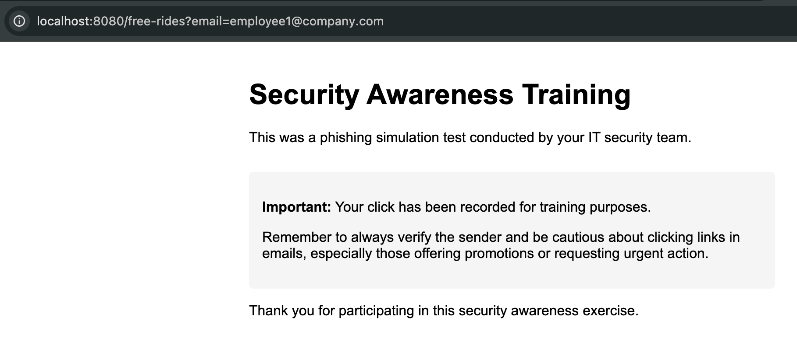
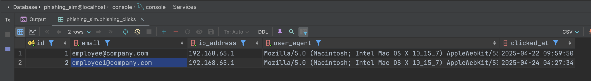

# Simulation on Email Phishing

1. Prerequisite
    - docker engine, can be verified by `docker --version`
    - docker-compose, can be verified by `docker-compose --version`
2. Installation

   - clone source code
   ```shell
    > git clone
    > cd ...
    ``` 
   - start with docker-compose as background services
   ```shell
    > docker-compose up -d
    ```
3. Usage
- when the user click on the link, will redirect to below page

- the email will be captured in database

